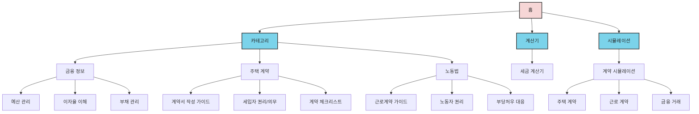

```mermaid

graph TD
A[홈] --> B[카테고리]
A --> C[계산기]
A --> D[시뮬레이션]

    B --> B1[금융 정보]
    B --> B2[주택 계약]
    B --> B3[노동법]

    B1 --> B1a[예산 관리]
    B1 --> B1b[이자율 이해]
    B1 --> B1c[부채 관리]

    B2 --> B2a[계약서 작성 가이드]
    B2 --> B2b[세입자 권리/의무]
    B2 --> B2c[계약 체크리스트]

    B3 --> B3a[근로계약 가이드]
    B3 --> B3b[노동자 권리]
    B3 --> B3c[부당처우 대응]

    C --> C1[세금 계산기]

    D --> D1[계약 시뮬레이션]

    D1 --> D1a[주택 계약]
    D1 --> D1b[근로 계약]
    D1 --> D1c[금융 거래]


    style A fill:#F6D6D6,stroke:#333,stroke-width:2px,color:#222
    style B fill:#7BD3EA,stroke:#333,stroke-width:2px,color:#222
    style C fill:#7BD3EA,stroke:#333,stroke-width:2px,color:#222
    style D fill:#7BD3EA,stroke:#333,stroke-width:2px,color:#222


```
