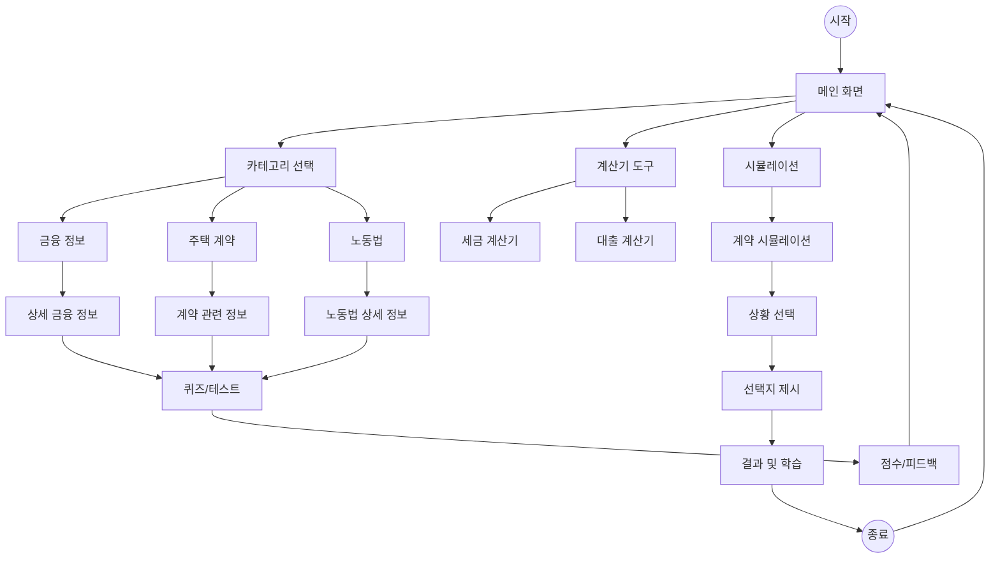

# User Flow Diagram

<!--
[텍스트]: 네모 박스
((텍스트)): 원형 박스
{텍스트}: 마름모 박스

실행 : ctrl + shift + v
pdf 내보내기 : Ctrl + Shift + P-->

```mermaid
flowchart TD
    Start((시작)) --> Home[메인 화면]

    Home --> Cat[카테고리 선택]
    Home --> Calc[계산기 도구]
    Home --> Sim[시뮬레이션]

    Cat --> Finance[금융 정보]
    Cat --> Housing[주택 계약]
    Cat --> Labor[노동법]

    Finance --> FinanceDetail[상세 금융 정보]
    Housing --> HousingDetail[계약 관련 정보]
    Labor --> LaborDetail[노동법 상세 정보]

    Calc --> TaxCalc[세금 계산기]
    Calc --> LoanCalc[대출 계산기]

    Sim --> ContractSim[계약 시뮬레이션]
    ContractSim --> Scenario[상황 선택]
    Scenario --> Choice[선택지 제시]
    Choice --> Result[결과 및 학습]

    Result --> SaveProgress((종료))
    SaveProgress --> Home

    FinanceDetail --> Quiz[퀴즈/테스트]
    HousingDetail --> Quiz
    LaborDetail --> Quiz

    Quiz --> Score[점수/피드백]
    Score --> Home
```
